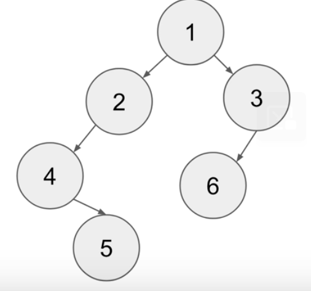
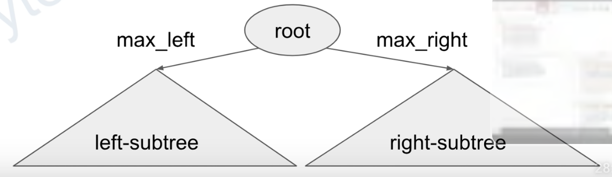

# Trees (Binary Search Tree, BST)

## Definition of a Binary Tree Node
```java
// TreeNode Definition
public class TreeNode {
    int val;
    TreeNode left;
    TreeNode right;
    TreeNode(int x) { val = x;}
}
```

```java
// To Create a Tree as the images below
root = TreeNode(1);
root.left = TreeNode(2);
root.right = TreeNode(3);
root.left.left = TreeNode(4);
root.left.left.right = TreeNode(5);
```



## Binary Search Tree
* Vals of left-subtree <= root.val < vals.of right-subtree
* Not Required to be balanced

```python
# Search in a Binary Tree 
def search(root, search_value):
    # The tree is empty -> return False
    if not root: return False
    # If root value == search value -> return True
    if search_value == root.val: return True
    # If search value < root value, search left-subtree instead
    if search_value < root.val:
        return search(root.left, search_value)
    # Otherwise, search the right-subtree
    else:
        return search(root.right, search_value)
```
* Time Complexity: O(h), where h is the height of tree
* Worse Case: O(h) = O(n)
* Best Case: O(h) = O(log n)

## Balanced Binary Tree
* The height of left / subtree are at most 1.
```python
def isBalanced(root):
    if not root: return True
    return abs(height(root.left) - height(root.right)) <= 1 and isBalanced(root.left) and isBalanced(root.right)
```

## Traversal
1. Preorder Traversal (*Left-Right-Root Pattern*)
```python
def preOrder(root):
    preOrder(root.left)
    preOrder(root.right)
    Process Root
```

2. Inorder Traversal (*Left-Root-Right Pattern*)
* Data is sorted when inorder is used.
```python
// In order Traversal with Recursion
def inOrder(root):
    if root is NULL, then return 
    inOrder(root.left)
    Process root
    inOrder(root.right)
```

1. Post Order (*Left-Right-Root Traversal*)
```python
def postOrder(root):
    if not root: return
    postOrder(root.left)
    postOrder(root.right)
    Process Root
```

## How to create a BST
```python
# Create a tree full picture
class TreeNode:
    def __init__(self, x):
        self.val = x
        self.left, self.right = None, None

def createBST(nums):
    root = None
    for num in nums:
        root = insert(root, num)
    return root

def insert(root, val):
    if not root: return TreeNode(val)
    if val <= root.val:
        root.left = insert(root.left, val)
    else:
        root.right = insert(root.right, val)
    return root

if __name__ == '__main__':
    root = createBST([5,3,1,4,7,6])
    inorder(root)
```

## Key to tree problems: Recursion
```python
# Find the max Value of a tree
def findMaxValue(root):
    if not root: return -inf
    max_left = findMaxValue(root.left)
    max_right = findMaxValue(root.right)
    return max(root.val, max_left, max_right)
```


## Templates
### Single Root
```python
# General Templates
def solve(root):
    # Empty Tree
    if not root: return ...
    # If specific condition is fulfilled, do something
    if f(root): return ...
    # Process with left-subtree recursively, return the result to variable left
    left = solve(root.left)
    # Same as above with right-subtree, and return the result to variable right
    right = solve(root.right)
    # Process the results with root, left, and right
    return g(root, left, right)
```

```python
# LC 104. Maximum Depth of Binary Tree
def maxDepth(root):
    if not root: return 0
    left = maxDepth(root.left)
    right = maxDepth(root.right)
    return max(left, right) + 1
```

```python
# LC 111. Minimum Depth of a Binary Tree
def minDepth(root):
    if not root: return 0
    if not root.left and not root.right: return 1
    left = minDepth(root.left)
    right = minDepth(root.right)
    if not root.left: return 1 + right
    if not root.right: return 1 + left
    return max(left, right) + 1
```

```python
# LC 112. Path Sum
def pathSum(root, sum):
    if not root: return False
    if not root.left and not root.right: return root.val == sum
    left = pathSum(root.left, sum - root.val)
    right = pathSum(root.right, sum - root.val)
    return left or right
```

### Two Root
```python
# General Template
# p, q can be trees
def solve(p, q):
    if not p and not q: return ...
    if f(p, q): return ...
    condition1 = solve(p.child, q.child)
    condition2 = solve(p.child, q.child)
    return g(p, q, c1, c2)
```

```python
# LC 100. Same Tree
def sameTree(p, q):
    if not p and not q: return True
    if not p or not q: return False
    left = sameTree(p.left, q.left)
    right = sameTree(p.right, q.right)
    return p.val == q.val and left and right
```

```python 
# LC 101. Symmetric Tree
def mirror(p, q):
    if not p and not q: return True
    if not p or not q: return False
    left = mirror(p.left, q.right)
    right = mirror(p.right, q.left)
    return p.val == q.val and left and right
```

```python
# LC 951. Flip Equivalent Binary Trees
def flipEquiv(p, q):
    if not p and not q: return True
    if not p or not q: return False
    left1 = flipEquiv(p.left, q.left)
    left2 = flipEquiv(p.left, q.right)
    right = flipEquiv(p.right, q.right)
    right = flipEquiv(p.right, q.left)
    return p.val == q.val and ((left1 and right1) or (left2 and right2))
```
