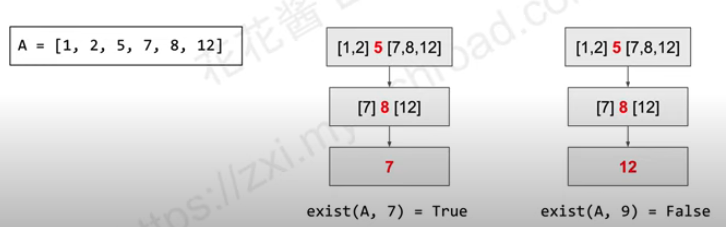

# Binary Search
## What is Binary Search?
* Reduce the search space by half at each step
* Input usually needs to be **sorted**
* 
## Why Binary Search?
* Fast
* Time Complexity: T(n) = T(n/2) + O(eval)
  * T(n/2): reduce the search space by half
  * O(eval): determine the value is needed or not
* O(log(range)) * O(eval) (Binary Search) vs (linear scan) O(range) * O(eval) 
* When the number range is greater than 10^7, consider using Binary Search

## Template
1. [left, right)
* [left, right): 左閉右開
  * [3, 5):  包含 3，4
* Time complexity: O(log(right - left)*(f(m) + g(m)))
* Space complexity: O(1)
* Overflow will happen if number = 2^31 - 1
```python
"""
Returns the smallest number m in range [left, right) such that
g(m) is true. Returns r if not found
"""
def binary_search(left, right):
    while left < right:
        # The middle index
        mid = left + (right - left) // 2
        if f(mid): 
            # Find the value you needed, do something below (Optional)
            return mid
        if g(mid):
            # If the value is less than mid, set the new range as [left, mid)
            right = mid
        else:
            # Otherwise (the value is greater than mid), set the new range as [mid + 1, right)
            left = mid + 1
    # Not found the value needed
    return left 
```

1. Return the lower_bound / upper_bound of a val in a sorted array (maybe not unique value)
* lower_bound(x): first element of i, such that A[i] >= x
* upper_bound(x): first element of i, such that A[i] > x
* A = [1, 2, 2, 2, 4, 4, 5]
* lower_bound(A, 2) = 1
* upper_bound(A, 2) = 4
```python
def lower_bound(A, val, left, right):
    while left < right:
        mid = left + (right - left) // 2
        # The condition of lower_bound
        if A[mid] >= val:
            right = m
        else:
            left = mid + 1
    return left

def upper_bound(A, val, left, right):
    while left < right:
        mid = left + (right - left) // 2
        # The condition of upper_bound
        if A[mid] > val:
            right = m
        else:
            left = mid + 1
    return left
```
* LC69. Sqrt(x)
* LC278. First Bad Version Interactive Problem
* LC 875. Koko eating bananas
* LC 378. Kth Smallest Element in a sorted matrix

3. [left, right]
* [left, right]: 左閉右閉
  * [3, 5] 包含3，4，5
* 盡量用這個吧
```python
def binary_search(left, right):
    while left <= right:
        mid = left + (right - left) // 2
        if g(m):
            right = mid - 1 # new range [l, m-1]
        else:
            left = mid + 1 # new range [m + 1, r]
    return left
```