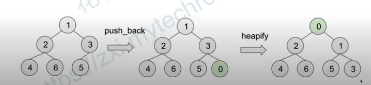
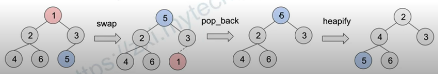
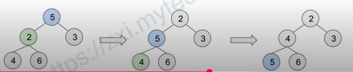

# Heap
## What is heap?
* Heap is a specialized tree-based data structure which is essentially an almost complete tree that satisfies the heap property
* Heap property (min heap): parent's key is less than the children's key
* aka. Priority Heap

## PseudoCode
1. Define a class for MinHeap
```C++
class MinHeap {
public:
    MinHeap(); // Create an empty heap
    MinHeap(const vector<int>& data); // Create a heap from a vector
    int peek() const; // Return the min element
    int pop(); // Extract the min element
    void push(int key); // Add a new element to the heap
    int size() const; // Return the size of the heap
private:
    void heapifyUp(int index);
    void heapifyDown(int index);
    vector<int> data_;
}
```

2. Push
* Add a new element to the heap
* 
```C++
// Add a new element to the heap
void push(int key) {
    // Add the element to the end of the array, O(1)
    data_.push_back(key);
    // Maintain the heap property, O(log n)
    heapifyUp(data_.size() - 1);
}
```

3. HeapifyUp
```C++
void heapifyUp(int index) {
    // Stop at root
    if (index == 0) return;
    int parent = (index - 1) / 2;
    // Stop if greater or equal to parent
    if (data_[index] >= data_[parent]) return;
    // Swap with parent
    swap(data_[index], data_[parent]);
    // Continue heapifyUp on Parent
    heapifyUp(parent);
}
```
4. Pop
* Extract the min element
* 
```C++
int pop() {
    // Swap the min element with the last one, O(1)
    swap(data_.back(), data_[0]);
    // Get the minimum element, O(1)
    int min_el = data_.back();
    // Evict the minimum element, O(1)
    data_.pop_back();
    // Maintain heap property, O(log n)
    heapifyDown(0);
    return min_el;
}
```

5. HeapifyDown
* 
```C++
void heapifyDown(int index) {
    int smallest = index;
    // Get the min child
    for (int c : {index * 2 + 1, index * 2 + 2})
        if (c < data_.size() && data_[c] < data_[smallest]) 
            smallest = c
    if (smallest == index) return;
    // Swap with min child
    swap(data_[index], data[smallest]);
    // Continue HeapifyDown on min_child
    heapifyDown(smallest);
}
```

6. Build a Heap
* Convert an array to heap
* Time Complexity: n/2 * log(n) = O(n log n)
* This is an upper bound. Tighter bound: O(n)
```C++
for i = (n - 1) /2 to 0:
    heapifyDown(i)
```

## Application
1. Heapsort
2. Dijkstra's algorithm
3. Priority Queue
4. Selection Algorithm