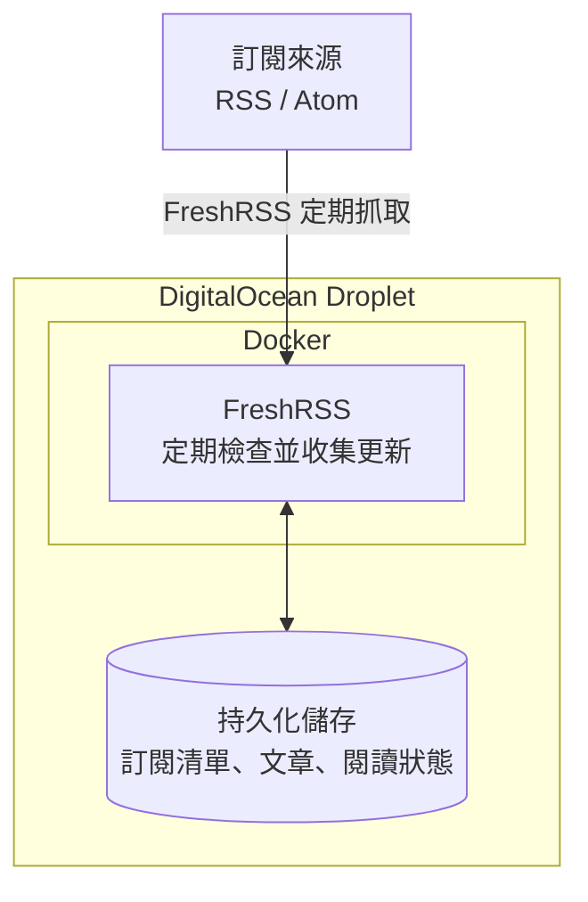
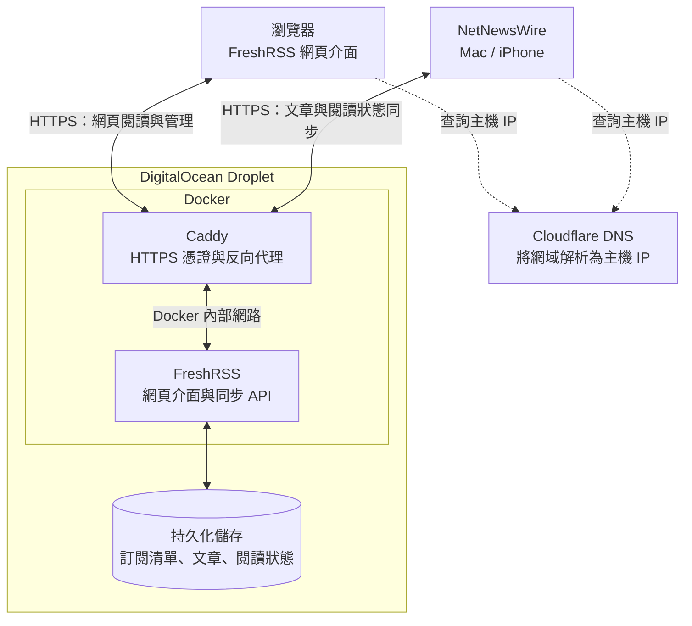

# 建立自己的資訊流：FreshRSS × NetNewsWire 架構筆記

## 1. 建置目標

建立由自己管理的資訊收集與閱讀系統，將訂閱清單、文章與閱讀狀態集中管理，減少對不同平台及推薦演算法的依賴。

核心分工是：

- **FreshRSS 負責收集與保存。**
- **NetNewsWire 負責閱讀。**
- **DigitalOcean 提供持續運作的環境。**
- **Cloudflare 與 Caddy 提供網域解析及 HTTPS 連線。**

本文聚焦系統架構，不包含實際網域。各來源的訂閱方式與內容處理，留待後續整理。

## 2. 整體架構

這套系統可以分成兩條流程：**收集資訊**與**閱讀同步**。

### 收集資訊

FreshRSS 在雲端主機上定期執行更新，因此不需要自己的 Mac 或 iPhone 一直開著。

只要 Droplet、FreshRSS 與排程正常運作，裝置關閉期間仍可繼續收集內容；裝置重新上線後，再同步回來。

### 閱讀與同步

此圖採用 Cloudflare **DNS only**：虛線表示透過 DNS 將網域解析為主機 IP 的邏輯流程，實際 HTTPS 連線直接到 Caddy。DNS 查詢通常由裝置設定的 DNS 解析器代為完成。

Caddy 是對外連線的入口。FreshRSS 則在 Docker 內部接收 Caddy 轉交的請求。

FreshRSS 主動向訂閱來源抓取內容時，通常不需要經過 Caddy；Caddy 主要處理使用者從外部連入服務的請求。

## 3. 各元件的角色

| 元件 | 主要責任 |
|---|---|
| **DigitalOcean Droplet** | 提供持續運作的 Linux 主機 |
| **Docker Compose** | 統一管理 FreshRSS、Caddy 的設定、啟動與重啟 |
| **FreshRSS** | 管理訂閱、收集文章、保存閱讀狀態及提供同步 API |
| **Caddy** | 自動管理 HTTPS 憑證，並反向代理至 FreshRSS |
| **Cloudflare Registrar／DNS** | 管理網域註冊，將網域解析到主機 IP |
| **NetNewsWire** | 提供 Mac／iPhone 上的閱讀介面與本機快取 |

這個設計下，**FreshRSS 是集中保存資料與閱讀狀態的地方**。NetNewsWire 從它同步內容，也將閱讀操作同步回去。

Cloudflare 若使用 **DNS only**，只負責網域解析；實際 HTTPS 流量會直接連到 Droplet 上的 Caddy。

## 4. FreshRSS 與 NetNewsWire 如何配合

NetNewsWire 透過 FreshRSS 提供的 **Google Reader 相容 API** 連線。這是 API 的相容格式名稱，不需要 Google 帳號。

設定流程：

1. 在 FreshRSS 啟用 API 存取。
2. 為使用者設定 API 密碼。
3. 在 NetNewsWire 新增 FreshRSS 帳號。
4. 填入服務網址、使用者名稱與 API 密碼。

同步後，日常操作方式如下：

| 操作 | 系統如何處理 |
|---|---|
| FreshRSS 收集到新文章 | NetNewsWire 下次同步時取得 |
| 在 NetNewsWire 標記已讀 | 同步後回寫 FreshRSS |
| 從另一部裝置閱讀 | 同步後取得最新閱讀狀態 |
| Mac／iPhone 關閉 | 雲端 FreshRSS 仍可繼續收集 |
| 裝置暫時離線 | 可閱讀已快取內容，待連線後再同步 |

NetNewsWire 也可能在背景更新，但會受作業系統及裝置狀態限制。雲端 FreshRSS 的價值，在於讓收集工作不必依賴個人裝置持續運作。

## 5. 部署與資料保存

FreshRSS 與 Caddy 使用 Docker Compose 管理，各自負責不同工作：

- FreshRSS 容器執行訂閱與閱讀服務。
- Caddy 容器提供對外 HTTPS 入口。
- 兩者透過 Docker 內部網路通訊。
- 文章、設定及憑證資料使用持久化儲存。

**容器可以重新建立，但重要資料必須保存在容器之外。**

需要備份的項目包括：

- FreshRSS 資料庫與使用者設定。
- 自行安裝的擴充套件。
- Docker Compose 設定。
- Caddyfile 與 Caddy 持久化資料。

持久化可以避免重建容器時遺失資料；備份則用來處理主機故障、誤操作或資料損壞，兩者都需要。

## 6. 架構的效益與維護責任

這套架構讓收集端與閱讀端分開：雲端負責持續收集，個人裝置提供閱讀體驗，未來也能依同步相容性更換閱讀工具。

相對地，需要自行維護：

- 主機與容器更新。
- 定期收集排程。
- 網域續費與服務連線。
- 資料備份及還原驗證。

本階段先建立穩定的收集、保存與同步基礎；各網站的訂閱方式、全文擷取、圖片載入及內容篩選，另行整理。
