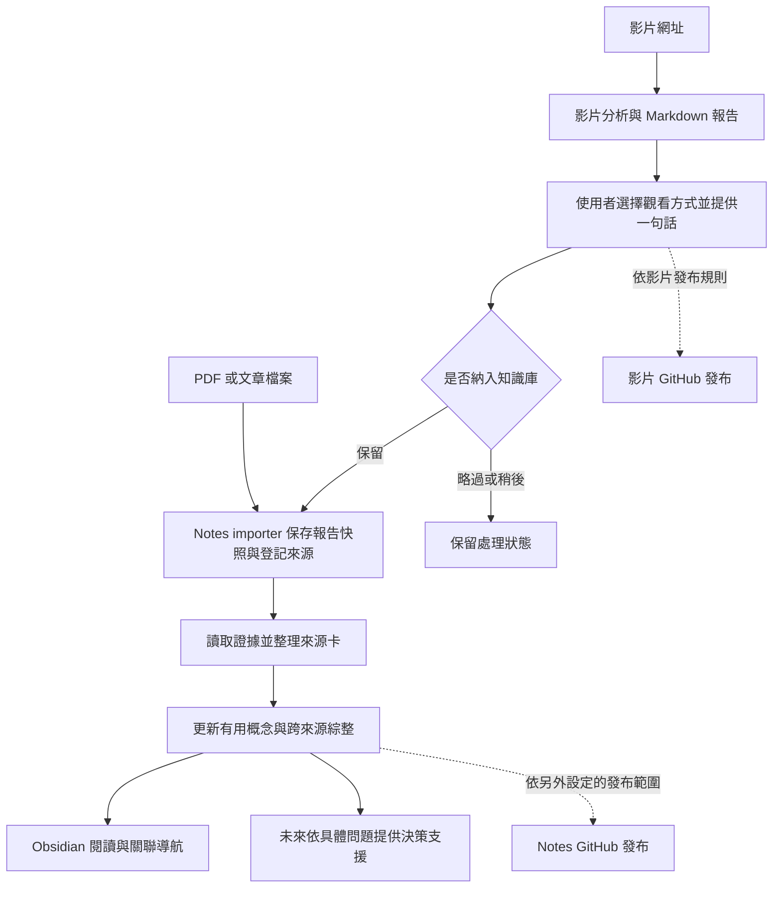

# 影片分析與 Notes 的 CLI 整合流程提案

## Question / Purpose

讓使用者在同一個 Codex CLI 入口完成影片篩選、個人回饋與知識整理，並留下未來決策可回查的資料。本文保存 2026-09-25 的初始整合提案；後續已確認採單一 Notes repo，並依使用者指示新增 video-analyze skill，其餘尚未完成的部分仍屬設計建議。

**啟用進度（2026-09-25）**：已加入 [video-analyze](../../.agents/skills/video-analyze/SKILL.md) 與配套報告範本，提供影片分析、心得紀錄與接續 llm-wiki-ingest 的規則。既有影片專案與舊報告沒有搬移；以下原先保留兩個 repo 的方案是討論起點。完整媒體取得／轉錄實測由另一個對話處理，背景排程、共用 GitHub 自動發布與決策引擎尚未建立。

本輪使用者明確提出：沿用影片專案的分析格式、看後給一句話、將選定內容交給 Notes 整理，未來以這些資料支援決策。既有 EP286 報告也記錄了建立個人決策與知識庫的方向；該報告沒有推定使用者完整收聽。[[2026-09-24--techporn-ep286|Key Claims／看完後的一句話]]

## Answer / Analysis

**助理建議：整合操作入口與交接流程，保留影片分析、知識整理、決策支援的職責。** 使用 CLI 不要求先合併 Git 儲存庫。以 Notes 作為啟動位置，由一個待建立的流程 skill 讀取兩邊規範、調用既有工具、保存處理進度；使用者不必手動搬檔或重複下達入庫指令。

### 已有能力與缺口

| 環節 | 本機檢查結果 | 第一版要補的部分 |
|---|---|---|
| 影片分析 | 現有範本已含摘要、觀看推薦、評分、影片 ID、分析層級、字幕覆蓋與信心 | 沿用格式，由統一入口選擇影片流程 |
| 個人回饋與發布 | 影片 AGENTS 已定義心得後驗證及 GitHub 發布；主要由 agent 依指令執行 | 明確識別回饋屬於哪份報告，持久記錄取捨與發布進度 |
| Notes 匯入 | importer 已接受影片報告，按來源身分去重、按 SHA 保存版本，繼承分析限制 | 在回饋完成後調用 importer 與整理 skill |
| 知識整理 | 現有 ingest skill 讀證據、整理來源卡、連結概念與綜整、更新索引及日誌 | 定義完成與受阻時如何回報給統一入口 |
| 決策支援 | 使用者已提出方向；本輪未驗證已有可運作的決策引擎 | 先保存問題、條件、證據、取捨及事後結果 |

本機依據：影片 [AGENTS.md](/Users/adrianli/Documents/Codex/video-content-filter-assistant/AGENTS.md)「交付後追蹤與 GitHub 發佈」、[報告範本](/Users/adrianli/Documents/Codex/video-content-filter-assistant/templates/video-summary.md)、Notes [README.md](../../README.md)「共用匯入／與影片篩選專案的分工」與 [import_source.py](../../scripts/import_source.py) `add_source`、`review_source`。這些是程式與契約現況，不代表本輪已跑過完整跨專案流程。

### 建議的日常流程

1. **分析影片。** 沿用現有 Markdown 格式，交付摘要、觀看建議和證據限制；個人心得保持空白。素材不足時保留 quick-screen／partial，不假裝完成完整分析。
2. **使用者回饋。** 可以看全片、只看片段、只讀摘要或略過。例如：「我只讀摘要，想保留其中的需求驗收方法，下次做工具前先寫驗收條件。」這只是操作示例，不是使用者已提出的心得。
3. **選擇保留。** 建議第一版對使用者選定且已回饋的報告自動入庫；「稍後看／不保留」只更新狀態。明確要求先入庫但未觀看的內容可保存，觀看狀態仍如實記錄。不能把有心得直接解讀為已完整觀看，也不能替使用者補上缺少的判斷或行動。
4. **保存版本。** 調用現有 importer，從影片專案正式報告建立 `raw/imports/<source-id>/<sha>.md` 快照、完整擷取及來源卡。原報告保持在原位置；不用先手動搬進 raw，也不覆寫舊快照。
5. **整理知識。** Codex 讀取報告證據、整理 source page、更新有用的既有概念和跨來源分析。Notes 的新增價值是連結、比較與保留分歧；無需再生成另一份相同的影片摘要。Obsidian 顯示筆記和連結，概念抽取與編輯由 Codex 執行。
6. **驗證與發布。** 完成本地整理後核對索引、schema、日誌及相關檢查。影片與 Notes 的 GitHub 發布各自記錄結果；單邊 push 失敗只重試該階段，不重做影片分析或重複建來源頁。

觀看推薦、是否收錄、證據可信度是三個不同判斷。不必看原片也可能值得保留一個方法；值得看原片也不表示其中所有主張已獲驗證。Notes 中的影片報告仍是 `secondary-summary`，不能因完整讀過報告而升格為原始逐字稿證據。[[2026-09-24--techporn-ep286|Follow-ups／分析依據、可信度與限制]]

### 最小交接資料

以下是待實作的資料需求，不是已加入的 schema 欄位：

- **來源身分與版本**：既有 `source_id`、影片 ID、平台／canonical URL、報告路徑、內容 SHA。先查 registry 重用既有身分；新來源可使用平台加 ID，避免跨平台撞名。心得更新是同一來源的新版本，不能算額外獨立證據。
- **證據範圍**：`analysis_level`、`transcript_coverage`、`confidence`、引用小節／可靠時間碼和限制，隨報告進 Notes。
- **人的輸入**：一句話原文、提供日期、實際觀看方式、保留／稍後／略過。沒有提供就保持未知；與作者主張、助理推論分開。
- **工作進度**：分析、回饋、入庫與核讀、影片發布、Notes 發布各自記錄；保留失敗原因和最後成功版本，方便下次 CLI 繼續。可先用一份小型本機工作清單，避免在不同檔案維護多套相同狀態。

現有影片範本的 `status: complete` 只代表分析完成，不能當作心得、入庫或發布許可。現有索引器也不會驗證個人心得門檻。發布時應明確選取本次可發布的報告，避免同步整個 summaries 時連帶發布其他尚待回饋的報告。這是橋接實作前需要明文化的契約細節。

### Codex CLI 如何承接

第一版以互動 CLI 承接人的回饋；把穩定的批次步驟自動化是後續工作。官方文件支援 `-C` 指定工作目錄、`--add-dir` 增加其他目錄寫入範圍；skill 可提供重複使用的工作流程，`codex exec` 則用於非互動執行。[CLI flags](https://learn.chatgpt.com/docs/developer-commands?surface=cli)、[Build skills](https://learn.chatgpt.com/docs/build-skills)、[Non-interactive mode](https://learn.chatgpt.com/docs/non-interactive-mode)。

以 Notes 啟動，追加影片工作目錄即可維持兩邊檔案位置；影片發布還涉及 `/Users/adrianli/Documents/GitHub/video-content-filter-assistant` 這個 clone。`--add-dir` 是目錄存取設定，不能假定會自動載入另一個專案的 skills 或規範；統一入口應明確讀取必要規範並配置依賴。

建議未來的使用體驗是「分析這支影片」與「這是我的一句話，請入庫」兩個階段；工作清單保留報告 ID，因此中斷 CLI 或隔天回覆仍可接續。**這個統一入口目前尚未建立。** 現在已可單獨用 Notes 的 `$llm-wiki-ingest` 接收完成的影片報告路徑。

純終端操作還要分別驗證影片資料取得與轉錄依賴：現有影片流程在缺乏字幕時包含 MacWhisper 本機轉錄，不能僅因 Codex 改用 CLI 就認為該步已可無人值守。先保留可讀字幕／現成報告的路徑，缺資料時明確受阻，之後再評估終端轉錄方案。

### 為未來決策保留什麼

**助理建議：知識庫提供可回查的依據；每次決策另外提供具體目標與限制。** 可以先用現有 synthesis 頁型記錄一個真實問題，無須現在擴增頂層目錄或另建決策服務。

建議記錄：問題、選項、目標與限制、支持／反對證據及來源版本、尚未驗證的假設、助理建議、使用者實際選擇、預期結果與事後結果。使用者的決定和結果都必須由實際輸入或可核對紀錄填寫，不能自動編造。

例如未來問「下一個工具是否採用某種架構」時，系統先取得預算、時間、維護能力，再比較 Notes 的相關證據及反例。收錄的篇數、觀看推薦分數、Obsidian 的連結數都不直接代表結論可靠度；來源卡 `ready` 也只表示記錄的核讀範圍完成。

## Citations

- [[2026-09-24--techporn-ep286]]：Key Claims 與上游「看完後的一句話」記錄使用者希望形成個人決策與知識庫；Follow-ups 保留影片二手報告的限制。
- 本機程式與工作契約：前述「已有能力與缺口」的檔案，以及影片 [PROJECT_BRIEF.txt](/Users/adrianli/Documents/Codex/video-content-filter-assistant/PROJECT_BRIEF.txt) 的 MacWhisper 轉錄步驟。核對日期為 2026-09-25，未進行本輪影片分析或 GitHub 發布。
- 官方 CLI／skill 文件：前述「Codex CLI 如何承接」連結；只用於確認入口、技能與非互動模式能力，不是整合流程已完成的證據。

## Implications

建議第一階段實作一個統一入口、可續接的處理紀錄，以及回饋後串接既有 Notes ingest 的流程。先用「正常入庫、同來源更新、略過／未看先保留、推送失敗接續」驗收，再增加決策頁與結果追蹤。保持本地保存與遠端發布分開，讓網路失敗不影響已完成的知識整理。

Notes 現有 `raw/imports/` 與 `derived/` 被 Git 忽略。推送 Notes 的整理頁不等於備份原始證據，仍需另外的本機備份安排；本提案沒有改變此設定。

## Related

- [[2026-09-24--ai-learning-knowledge-management|AI 輔助學習與知識管理]]：既有方法比較與來源限制。
- [[2026-09-24--techporn-ep286|影片報告來源卡]]：已驗證可用的影片報告入庫例子。

## Follow-up Questions

- 入庫預設是否採「已選定且提供心得即入庫」，以及未觀看但要保留時的操作措辭？
- 正式實作時，Notes 是否與影片報告一起 commit／push，還是先維持本地整理、分別發布？
- 要用哪一個真實決策問題驗收目標、來源依據、實際選擇與後續結果的可追溯性？
